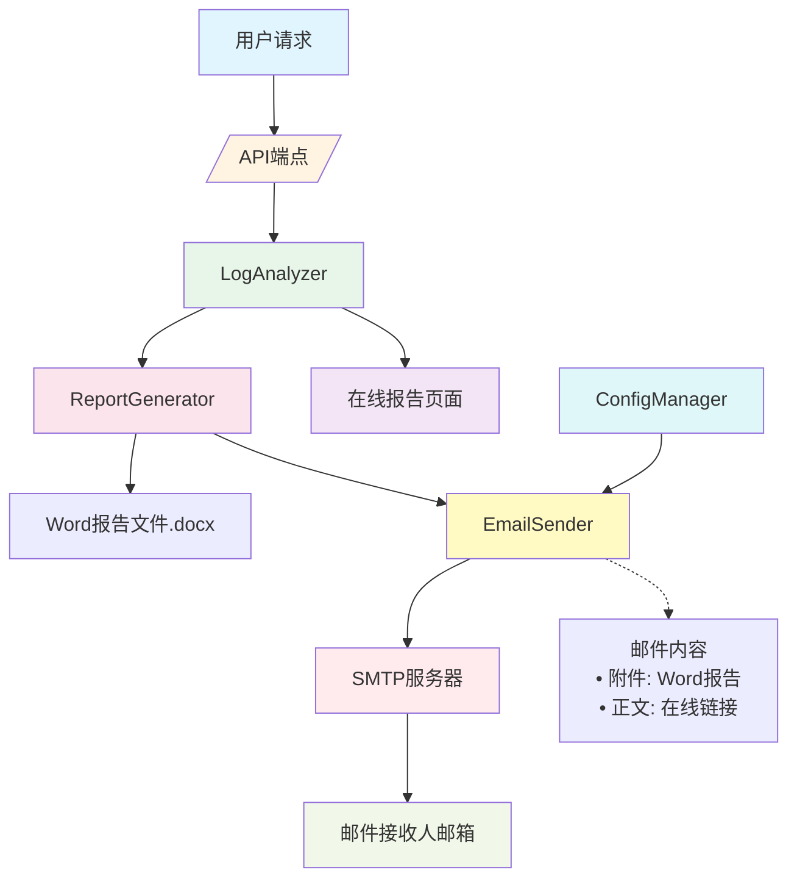
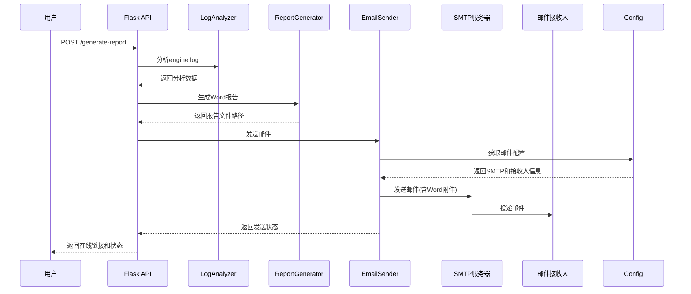

# Report Generation and Email Sending

Feature Name: report-generation-and-email-sending
Updated: 2026-02-02

## Description

本功能为现有的日志分析系统添加报告生成和邮件发送能力。系统将在日志分析的基础上，自动生成Word格式的测试报告，并通过邮件发送给配置的接收人。邮件包含Word报告作为附件，以及可点击的在线报告链接，接收人可以通过链接直接查看最新的日志分析结果。

## Architecture



### 数据流程



## Components and Interfaces

### 1. ReportGenerator (报告生成器)

**职责**: 根据日志分析数据生成Word格式报告文档

**接口**:
```python
class ReportGenerator:
    def __init__(self, template_path: str = None)
    def generate_report(self, analysis_data: dict, output_path: str) -> str
        """
        生成Word报告
        
        参数:
            analysis_data: 日志分析数据 (包含test_cases, total, errors等)
            output_path: 输出文件路径
            
        返回:
            生成的Word文件路径
        """
    def _add_title_page(self, doc: Document, data: dict)
    def _add_summary_section(self, doc: Document, data: dict)
    def _add_test_case_table(self, doc: Document, test_cases: list)
    def _add_error_details(self, doc: Document, test_cases: list)
    def _add_footer(self, doc: Document)
```

**依赖**:
- `python-docx` 库

### 2. EmailSender (邮件发送器)

**职责**: 通过SMTP服务器发送包含Word附件的邮件

**接口**:
```python
class EmailSender:
    def __init__(self, smtp_config: dict)
    def send_report_email(
        self,
        recipients: list,
        subject: str,
        report_file_path: str,
        online_url: str,
        summary: dict
    ) -> bool
        """
        发送报告邮件
        
        参数:
            recipients: 邮件接收人列表
            subject: 邮件主题
            report_file_path: Word报告文件路径
            online_url: 在线报告URL
            summary: 报告摘要信息 (total, errors, etc.)
            
        返回:
            发送成功返回True, 否则返回False
        """
    def _create_email_body(self, online_url: str, summary: dict) -> str
    def _retry_send(self, mail: MIMEMultipart, max_retries: int = 3) -> bool
    def validate_email(self, email: str) -> bool
```

**依赖**:
- `smtplib`, `email` 标准库
- SMTP服务器配置

### 3. ConfigManager (配置管理器)

**职责**: 管理系统配置，包括邮件接收人和SMTP配置

**接口**:
```python
class ConfigManager:
    def __init__(self, config_path: str = 'config.yaml')
    def load_config(self) -> dict
    def save_config(self, config: dict)
    def get_recipients(self) -> list
    def set_recipients(self, recipients: list) -> bool
    def get_smtp_config(self) -> dict
    def validate_email(self, email: str) -> bool
```

**配置文件格式** (config.yaml):
```yaml
email:
  smtp:
    host: "smtp.example.com"
    port: 587
    use_tls: true
    username: "user@example.com"
    password: "password"
  recipients:
    - "user1@example.com"
    - "user2@example.com"
  
report:
  output_dir: "reports"
  template_path: "templates/report_template.docx"
```

### 4. 新增API端点

#### POST /api/generate-report
触发报告生成和邮件发送

**请求参数**:
```json
{
  "log_file_path": "/path/to/engine.log",  // 可选，默认使用static/engine.log
  "recipients": ["email@example.com"]      // 可选，覆盖配置中的接收人
}
```

**响应**:
```json
{
  "success": true,
  "report_file": "/reports/日志分析报告_20260202_143000.docx",
  "online_url": "http://localhost:5000/analysis",
  "email_sent": true,
  "email_recipients": ["user1@example.com", "user2@example.com"],
  "summary": {
    "total": 10,
    "normal": 8,
    "errors": 2
  }
}
```

#### GET /api/recipients
获取当前配置的邮件接收人列表

**响应**:
```json
{
  "recipients": ["user1@example.com", "user2@example.com"]
}
```

#### POST /api/recipients
更新邮件接收人列表

**请求参数**:
```json
{
  "recipients": ["user1@example.com", "user2@example.com"]
}
```

**响应**:
```json
{
  "success": true,
  "message": "邮件接收人已更新"
}
```

#### GET /api/smtp-config
获取SMTP服务器配置（不包含密码）

**响应**:
```json
{
  "smtp": {
    "host": "smtp.example.com",
    "port": 587,
    "use_tls": true,
    "username": "user@example.com"
  }
}
```

#### POST /api/smtp-config
更新SMTP服务器配置

**请求参数**:
```json
{
  "host": "smtp.example.com",
  "port": 587,
  "use_tls": true,
  "username": "user@example.com",
  "password": "password"
}
```

## Data Models

### Word报告数据结构

报告使用标准的Word文档格式，包含以下章节：

1. **封面页**
   - 报告标题
   - 生成时间
   - 摘要信息

2. **执行摘要**
   - 测试用例总数
   - 正常用例数
   - 异常用例数
   - 总组件数

3. **测试用例详情表**
   - 列: 测试用例ID, 组件模块, 组件中文名, 组件方法名, 运行结果
   - 行: 每个测试用例的数据

4. **异常详情**
   - 异常测试用例列表
   - 每个异常的完整错误信息
   - 错误上下文（可选）

5. **页脚**
   - 生成时间
   - 系统标识

### 邮件数据结构

```python
EmailMessage = {
    'subject': str,              # 邮件主题
    'from': str,                 # 发件人地址
    'to': List[str],             # 接收人列表
    'cc': List[str],             # 抄送列表 (可选)
    'body': str,                 # HTML格式邮件正文
    'attachments': List[str],     # 附件文件路径列表
    'priority': str              # 邮件优先级 (normal/high/low)
}
```

## Correctness Properties

### Word报告生成
- **完整性**: Word报告必须包含日志分析的所有测试用例数据
- **准确性**: Word报告中的统计数据必须与在线分析页面一致
- **格式正确性**: Word报告必须能被Microsoft Word正常打开和编辑
- **命名规范**: 报告文件名必须符合"日志分析报告_YYYYMMDD_HHMMSS.docx"格式

### 邮件发送
- **接收人覆盖**: 所有配置的接收人都必须收到邮件
- **附件完整性**: Word报告附件必须完整且可下载
- **链接有效性**: 邮件中的在线链接必须能正常访问
- **格式正确性**: 邮件正文HTML必须符合标准格式，链接可点击

### 配置管理
- **邮箱验证**: 只有格式正确的邮箱地址才能被保存为接收人
- **配置持久化**: 配置更新后必须持久化到配置文件
- **默认配置**: 如果配置不存在，系统必须使用合理的默认值

### API响应
- **一致性**: API响应格式必须始终一致
- **错误处理**: 失败时必须返回清晰的错误信息和HTTP状态码
- **幂等性**: 相同的重复请求不应产生副作用（如重复发送邮件）

## Error Handling

### Word报告生成错误
| 错误场景 | 处理方式 | 用户提示 |
|---------|---------|---------|
| python-docx库未安装 | 返回500错误 | "系统缺少必要的依赖库，请联系管理员" |
| 日志文件不存在 | 返回404错误 | "指定的日志文件不存在" |
| 日志格式错误 | 返回400错误 | "日志文件格式不正确" |
| 报告目录无写入权限 | 返回500错误 | "报告目录无法写入，请检查权限" |
| 生成报告失败 | 返回500错误，记录详细日志 | "报告生成失败，请联系管理员" |

### 邮件发送错误
| 错误场景 | 处理方式 | 用户提示 |
|---------|---------|---------|
| SMTP服务器连接失败 | 重试3次，仍失败则记录日志 | "邮件发送失败，请检查SMTP服务器配置" |
| 认证失败 | 记录日志，不重试 | "SMTP认证失败，请检查用户名和密码" |
| 邮箱地址格式错误 | 返回400错误 | "邮箱地址格式不正确" |
| 附件文件不存在 | 返回400错误 | "报告文件不存在" |
| 发送超时 | 重试3次，仍超时则记录日志 | "邮件发送超时，请稍后重试" |

### 配置管理错误
| 错误场景 | 处理方式 | 用户提示 |
|---------|---------|---------|
| 配置文件不存在 | 使用默认配置，记录警告日志 | "使用默认配置" |
| 配置文件格式错误 | 返回500错误 | "配置文件格式错误" |
| 配置文件写入失败 | 返回500错误 | "无法保存配置，请检查文件权限" |
| 配置参数验证失败 | 返回400错误 | 具体验证错误信息 |

### API错误响应格式
```json
{
  "success": false,
  "error": {
    "code": "ERROR_CODE",
    "message": "用户友好的错误信息",
    "details": "详细的错误信息（开发环境）"
  }
}
```

## Test Strategy

### 单元测试
- **ReportGenerator测试**
  - 测试各种日志格式的报告生成
  - 测试报告各章节内容的正确性
  - 测试文件名生成逻辑
  - 测试空数据、单条数据、大量数据的边界情况

- **EmailSender测试**
  - 测试邮件格式正确性
  - 测试附件添加功能
  - 测试HTML邮件正文生成
  - 测试邮箱地址验证
  - 测试重试逻辑（使用mock）

- **ConfigManager测试**
  - 测试配置文件的读取和保存
  - 测试邮箱格式验证
  - 测试默认配置生成
  - 测试配置参数的类型和范围验证

### 集成测试
- **端到端流程测试**
  - 测试从日志分析到邮件发送的完整流程
  - 测试API端点的请求和响应
  - 测试在线链接的可访问性
  - 测试Word文件的下载和打开

### 邮件测试
- **实际邮件发送测试**（测试环境）
  - 使用测试SMTP服务器验证邮件发送
  - 验证邮件主题、正文、附件的正确性
  - 验证HTML链接的可点击性
  - 验证多个接收人的邮件投递

### 性能测试
- **报告生成性能**
  - 测试大日志文件（10MB+）的报告生成时间
  - 测试并发生成报告的性能
- **邮件发送性能**
  - 测试大量接收人（100+）的邮件发送性能
  - 测试大附件（5MB+）的邮件发送时间

### 兼容性测试
- **Word兼容性**
  - 测试生成的Word文件在Microsoft Word 2016+中的兼容性
  - 测试生成的Word文件在LibreOffice/WPS中的兼容性
- **邮件客户端兼容性**
  - 测试邮件在不同邮件客户端（Outlook, Gmail, Foxmail等）中的显示效果

### 安全测试
- **配置安全**
  - 验证密码不在API响应中暴露
  - 验证敏感配置文件的权限设置
- **输入验证**
  - 测试恶意输入（SQL注入、XSS等）的防护
  - 测试路径遍历攻击的防护

## References

[^1]: (Filename) - 现有日志分析应用实现 (/workspace/app.py)
[^2]: (Filename) - 项目需求文档 (/workspace/README.md)
[^3]: (Website) - python-docx官方文档 (https://python-docx.readthedocs.io/)
[^4]: (Website) - Python smtplib文档 (https://docs.python.org/3/library/smtplib.html)
[^5]: (Website) - MIME邮件格式标准 (https://tools.ietf.org/html/rfc2045)
